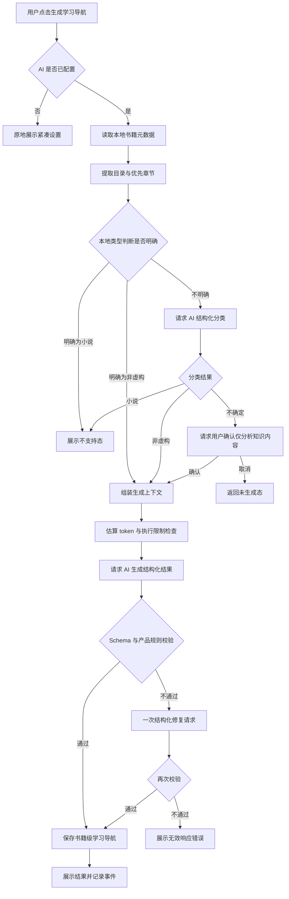

# Readest「学明白这本书」产品需求文档

## 1. 文档信息

- 功能名称：学明白这本书 / Book Learning Guide
- 工作名称：学习导航
- 状态：Phase 1+2 已实现，Phase 3 待规划
- 适用端：Readest Web、Desktop、iOS、Android
- 支持范围：非虚构书籍
- 相关模块：书籍详情、Reader、Notebook、Notebook Assistant、书籍元数据、目录与章节解析、AI Provider、Notebook Cards

## 2. 产品定义

用户在正式阅读一本非虚构书籍前，可以让 AI 回答：

> 我要把这本书真正学明白，需要注意什么？

这个功能不负责提前总结全书，也不替用户读书。它要帮助读者建立一个可持续使用的学习框架：知道本书试图解决什么问题、哪些概念最重要、应该怎样组织书中的知识，以及阅读时需要持续检验什么。

产品承诺：

> 在开始阅读前，给你一张理解这本书的地图，而不是一份替代阅读的答案。

## 3. 用户问题

读者打开一本知识型书籍时，经常面临以下困难：

- 不知道作者真正试图回答什么问题。
- 容易记住案例和术语，却看不见背后的共同机制。
- 不清楚哪些内容是核心框架，哪些只是说明材料。
- 读完部分章节后，无法判断自己的理解是否仍在主线上。
- 通用 AI 摘要会提前给出结论，却没有告诉读者应当怎样学习。

学习导航要把用户从“翻开书”带到“带着明确问题开始阅读”。

## 4. 产品目标与非目标

### 4.1 目标

1. 在开始阅读前，为非虚构书籍生成一份短而可执行的学习导航。
2. 帮助读者识别核心问题、前置知识、理论框架和注意事项。
3. 将零散概念组织成一条可以贯穿全书的理解主线。
4. 给出可用于自我检验的学习问题，但不提前替用户回答。
5. 将结果保存为书籍级成果，在阅读过程中随时回看。
6. 明确展示生成依据和信息边界，避免模型伪装成已经完整读过全书。

### 4.2 非目标

首版不包含：

- 小说、诗歌、戏剧、故事集和以虚构叙事为主体的作品分析。
- 情节梳理、人物分析、象征解读或文学鉴赏。
- 完整的全书摘要、逐章摘要或结论速读。
- 自动生成整本书知识图谱。
- 推断用户的学历、专业水平或认知能力。
- 跨书比较、课程规划或考试题库。
- 在未获得足够书籍内容时假装已经理解整本书。

## 5. 核心产品判断

### 5.1 它不是摘要

摘要回答“书里说了什么”，学习导航回答“我要怎样理解它”。生成内容应尽量使用问题、关系、边界和检验方式，而不是直接罗列作者结论。

### 5.2 它是书籍级成果

学习导航与当前页、当前章节的摘要不同。它属于整本书，生成一次后在书籍详情和阅读器 Notebook 中展示同一份结果。

### 5.3 它只服务非虚构学习

首版宁可拒绝不适合的作品，也不为所有书籍强行生成相似模板。分类为虚构文学时，不进入生成请求。

### 5.4 它必须诚实表达信息范围

生成结果必须显示依据，例如：

> 基于书籍简介、目录和序言生成

如果只有元数据，则显示：

> 基于书籍信息生成的初步建议，打开书籍后可生成更可靠的版本

## 6. 目标用户与使用场景

### 6.1 目标用户

- 希望系统学习一本书，而不是快速浏览摘要的读者。
- 阅读社科、商业、历史、哲学、科普、技术和教材类内容的读者。
- 容易在长书中失去主线，希望获得持续阅读锚点的读者。

### 6.2 核心场景

1. 用户在书库中查看一本新导入的书，尚未开始阅读。
2. 用户第一次打开书籍，想先知道应该关注什么。
3. 用户阅读若干章节后偏离主线，希望回看最初的理解框架。
4. 用户发现首次结果依据不足，希望在获得更多正文后重新生成。

## 7. 信息架构与入口

### 7.1 主入口：书籍详情

在书籍封面、书名和作者信息之后，元数据折叠区之前增加“学习导航”区域。

未生成时只显示一句价值说明和一个主操作：

```text
学习导航
在开始阅读前，先弄清这本书真正要解决的问题。

[生成学习导航]
```

选择这里作为主入口的理由：

- 用户仍处于读前决策阶段。
- 书籍详情已经拥有标题、作者、简介、主题等元数据。
- 不会打断打开书籍后的沉浸阅读。

### 7.2 次入口：阅读器 Notebook

在 Notebook 的 AI 能力区增加“学习导航”入口。若已生成，显示“查看学习导航”；若未生成，显示“生成学习导航”。

次入口用于阅读过程中的回看与重新生成，不创建第二份结果。

### 7.3 首次打开提示

Phase 1+2 不提供首次打开 Toast。用户通过书籍详情和 Notebook 主动使用学习导航，避免打断沉浸阅读。

## 8. UI 设计方向

### 8.1 视觉论点

- 视觉氛围：安静、编辑化、以阅读内容为中心。
- 内容结构：先建立方向，再展示框架，最后给出检验问题。
- 交互原则：不使用聊天气泡，不制造“AI 正在与你对话”的噪声。
- 设计体系：沿用 Readest 的 Adwaita 表面层级、`base-*` 主题令牌与 e-ink 规则。
- CSS 策略：仅使用现有 Tailwind 与 daisyUI 令牌，不引入 CSS Modules 或新的动效库。

### 8.2 可借鉴的产品机制

- NotebookLM：强调来源范围和结果依据，值得借鉴其“先说明使用了哪些来源”的做法。
- Readwise Reader：把 AI 能力放进阅读上下文，而不是建立脱离原文的独立工作区。
- Blinkist 类摘要产品：证明读者需要读前定位，但本功能不采用“替你读完”的摘要模式。

### 8.3 设计签名

结果页使用“一条理解主线”作为视觉锚点。它不是装饰图，而是将全书机制压缩成一条可扫描的因果或论证链，例如：

```text
快速直觉产生判断
→ 用简单问题替代复杂问题
→ 连贯故事带来过度信心
→ 风险与得失判断被扭曲
→ 需要用流程和制度纠正
```

在 e-ink 模式中，主线使用文本、箭头和 1px 分隔，不依赖色块、阴影或渐变。

## 9. 页面与状态设计

### 9.1 书籍详情中的未生成态

```text
┌──────────────────────────────────────┐
│ 学习导航                              │
│ 在开始阅读前，先弄清这本书真正要解决  │
│ 的问题，以及阅读时应该持续关注什么。  │
│                                      │
│                       [生成学习导航] │
└──────────────────────────────────────┘
```

设计要求：

- 使用 Card 层级：`bg-base-100`、`border-base-200`、`rounded-lg`、`eink-bordered`。
- 标题使用 `text-base font-semibold`，说明使用 `text-sm text-base-content/70`。
- 每个表面最多一个强调操作，“生成学习导航”使用 `btn btn-primary`。
- 按钮高度和可点击区域不小于 40px。
- 不使用彩色渐变、发光图标或大面积 AI 品牌色。

### 9.2 生成前确认态

点击按钮后不打开阻塞式确认弹窗。如果预计输入超过用户设置的 token 提醒阈值，则沿用 Notebook Assistant 的用量提醒方式；否则直接进入生成态。

若 AI 尚未配置，原地展开紧凑设置区，复用 `NotebookAssistantPanel compact`。

### 9.3 生成态

```text
┌──────────────────────────────────────┐
│ 正在整理这本书的学习重点              │
│ 已读取：书籍信息、目录、序言           │
│                                      │
│ 识别核心问题                         │
│ 整理关键概念                         │
│ 建立理解主线                         │
│                                      │
│                              [取消] │
└──────────────────────────────────────┘
```

设计要求：

- 文案描述真实的处理阶段，不显示虚假的精确百分比。
- 使用现有 Spinner，动效只用于旋转状态图标。
- 遵循 `prefers-reduced-motion`，e-ink 模式不做连续骨架闪烁。
- 用户可以取消请求。取消后保留未生成态，不写入半成品。

### 9.4 结果态

结果采用单列长内容，不使用五张同质卡片。各区块通过标题、留白和细分隔线形成层级。

```text
┌──────────────────────────────────────┐
│ 学明白这本书                         │
│ 基于目录、序言与可用正文生成           │
│                                      │
│ 先抓住这个目标                       │
│ 理解人的判断为什么会系统性偏离理性，  │
│ 以及我们能否识别并纠正这些偏差。      │
│                                      │
│ 理解主线                             │
│ 快速直觉 → 问题替代 → 过度信心        │
│ → 决策偏差 → 流程纠正                 │
│                                      │
│ 真正学明白时要注意                   │
│ 1. 系统一和系统二是解释模型……         │
│ 2. 找出不同偏差背后的共同机制……       │
│ 3. 区分解释得通与证据充分……           │
│                                      │
│ 读完后检验自己                       │
│ □ 系统一为什么不可缺少又会犯错？      │
│ □ 知道一种偏差为何不足以避免它？      │
│                                      │
│ [继续阅读]        [更多 ···]          │
└──────────────────────────────────────┘
```

结果区块固定为：

1. **先抓住这个目标**：一句话说明本书的核心学习目标。
2. **理解主线**：3 至 7 个节点组成的关系链。
3. **真正学明白时要注意**：4 至 8 条学习提醒，每条包含理由或判断方法。
4. **读完后检验自己**：3 至 6 个不直接给答案的自测问题。

可选区块：

- **开始前最好知道**：只有确实存在前置知识门槛时展示，最多 5 项。
- **证据与争议**：只有书中重要论断存在适用边界、证据层级或公认争议时展示。

结果页操作：

- 主操作：“继续阅读”或“开始阅读”。
- 更多菜单：“重新生成”“复制 Markdown”“删除学习导航”。
- “重新生成”需要二次确认是否替换现有版本，旧版本不保留在首版 UI 中。
- “删除学习导航”使用破坏性确认，不能删除书籍、笔记或其他 Notebook Cards。

### 9.5 不支持态

确定为虚构文学时：

```text
学习导航目前只支持非虚构书籍
这本书被识别为小说或文学作品，因此不会生成知识框架分析。
```

不显示强制继续按钮，避免用户绕过产品边界。

### 9.6 分类不确定态

当模型无法可靠判断书籍类型时：

```text
无法确认这是否是非虚构书籍
我们可以只分析其中的知识与观点，不涉及情节、人物或文学解读。

[仅分析知识内容] [暂不生成]
```

用户确认后，请求中写入 `knowledgeOnly: true`。输出仍不得包含文学分析。

### 9.7 信息不足态

当只有书名、作者等少量元数据时：

```text
目前只能生成初步建议
打开书籍后，Readest 可以结合目录、序言和正文生成更可靠的学习导航。

[生成初步建议] [先打开书籍]
```

初步结果顶部持续显示“初步建议”标签，并提供“使用书中内容更新”。

### 9.8 错误态

错误应就地显示，不清空已有结果：

- AI 未配置：“先设置 AI 服务，再生成学习导航。”
- 网络失败：“未能连接 AI 服务，请重试。”
- 超时：“生成时间过长，已停止本次请求。”
- 内容无法提取：“没有获得足够的书籍内容，暂时无法生成可靠导航。”
- 模型输出无效：“AI 返回的内容不完整，请重新生成。”

## 10. 响应式与可访问性

### 10.1 Desktop 与 Web

- 书籍详情 Modal 保持现有宽度时，学习导航入口以单列 Card 展示。
- 完整结果不挤在 480px 的详情弹窗中，点击后进入详情内的子页面，并提供明确返回操作。
- 结果正文最大可读宽度约 65 个中文字符，超宽窗口不无限拉长行宽。

### 10.2 Mobile

- 结果使用全高页面或现有全屏 Sheet，不使用小尺寸居中 Modal。
- 底部主操作考虑 safe area inset。
- 操作按钮保持自然宽度，不默认铺满整行。
- 标题、按钮和中文长文案在 320px 与 375px 宽度下不得截断。

### 10.3 E-ink

- 所有自定义表面添加 `eink-bordered`。
- 主操作使用 `btn-primary`，以黑白反转维持层级。
- 不依赖阴影、透明渐变或动画表示状态。
- 生成态以静态阶段文本加轻量状态图标呈现，减少刷新。

### 10.4 Keyboard 与 Screen Reader

- 所有操作使用语义化 `<button>`。
- 图标按钮必须包含 `aria-label`。
- 焦点使用 `focus-visible:ring-2 focus-visible:ring-base-content/15`。
- 结果标题遵循 `h1`、`h2` 层级，自测问题使用语义化列表。
- 生成完成时通过 `aria-live="polite"` 宣告结果可用。
- RTL 布局只使用逻辑方向属性，例如 `ms-*`、`me-*`、`text-start`。

## 11. 书籍分类逻辑

### 11.1 分类结果

```ts
type BookLearningEligibility =
  | {
      status: 'supported';
      category: NonFictionCategory;
      confidence: number;
      evidence: string[];
    }
  | {
      status: 'unsupported_fiction';
      confidence: number;
      evidence: string[];
    }
  | {
      status: 'uncertain';
      confidence: number;
      evidence: string[];
    };

type NonFictionCategory =
  | 'social_science'
  | 'business'
  | 'history'
  | 'philosophy'
  | 'science'
  | 'technology'
  | 'textbook'
  | 'biography'
  | 'essay'
  | 'other_nonfiction';
```

### 11.2 两阶段判断

第一阶段使用本地元数据快速判断：

- `subject`、`description`、Calibre 分类标签。
- EPUB metadata 中的 `dc:type` 与 BISAC、Thema 等已有主题信息。
- 明确的小说、fiction、novel、诗歌、戏剧标签。

第二阶段仅在本地判断不明确时交给 AI：

- 输入书名、作者、简介、目录标题和序言片段。
- AI 只返回结构化分类结果，不同时生成学习导航。
- `unsupported_fiction` 置信度大于或等于 0.8 时直接拒绝。
- `supported` 置信度大于或等于 0.7 时允许生成。
- 其他情况进入 `uncertain`，由用户决定是否仅分析知识内容。

不得仅凭书名中的单个关键词判定类型。

### 11.3 混合类型

- 传记、纪实文学、随笔和案例叙事型商业书可以支持。
- 输出只分析知识、观点、证据和方法，不分析文学技巧。
- 短篇合集、寓言和以故事承载观点的作品进入 `uncertain`。

## 12. 内容采集与来源优先级

生成学习导航时按以下优先级收集内容：

1. 书名、作者、语言、主题、简介。
2. 完整目录结构与章节标题。
3. 序言、前言、导论、引言。
4. 第一章或开篇章节。
5. 可用时提取结语或总结章节，但不得向用户剧透式复述结论。
6. 已建立索引时，从全书检索与“目的、框架、方法、结论、限制”相关的代表性片段。

首版设置输入上限，按用户的 Notebook Assistant `costMode` 调整：

- `conservative`：元数据、目录、序言，最多约 8,000 输入 token。
- `balanced`：增加导论和代表性章节片段，最多约 16,000 输入 token。
- `full_context`：增加检索片段，最多约 32,000 输入 token，仍不默认发送整本书。

内容不足时必须降级，不自动触发高成本的全书索引。

## 13. AI 输出契约

```ts
interface BookLearningGuide {
  schemaVersion: 1;
  bookKey: string;
  status: 'preliminary' | 'grounded';
  category: NonFictionCategory;
  learningGoal: string;
  understandingPath: Array<{
    id: string;
    label: string;
  }>;
  attentionPoints: Array<{
    id: string;
    title: string;
    explanation: string;
    checkQuestion?: string;
  }>;
  prerequisites?: Array<{
    concept: string;
    whyNeeded: string;
  }>;
  evidenceAndCaveats?: Array<{
    claim: string;
    caveat: string;
  }>;
  masteryQuestions: string[];
  provenance: {
    sourceKinds: Array<'metadata' | 'toc' | 'preface' | 'chapter' | 'retrieval'>;
    sourceFingerprint: string;
    provider: string;
    model: string;
    promptVersion: number;
    generatedAt: number;
  };
}
```

约束：

- `learningGoal` 最多 80 个中文字符或等价长度。
- `understandingPath` 为 3 至 7 个节点。
- `attentionPoints` 为 4 至 8 项，每项必须解释“为什么要注意”。
- `masteryQuestions` 为 3 至 6 项，不返回参考答案。
- 不使用“你只需要”“三分钟读懂”等承诺。
- 不逐章概括，不输出主要结论清单。
- 不生成情节、人物或文学手法分析。
- 对有争议或证据不稳定的内容表达边界，不把单个实验写成普遍真理。
- 无法满足契约时返回可识别的 abstain 结果，不用空字符串代替。

## 14. Prompt 设计

### 14.1 System 规则

```text
你是非虚构书籍的学习导航编辑。你的任务不是总结或替代阅读，
而是帮助读者建立理解目标、理论框架、注意事项和自我检验问题。

只分析知识、观点、方法、证据与适用边界。
不得分析小说情节、人物、象征或文学技巧。
不得假装读过输入中未提供的内容。
区分作者主张、书中证据与模型推断。
输出必须符合给定 JSON Schema。
```

### 14.2 User 任务

```text
请回答：我要把这本书真正学明白，需要注意什么？

基于提供的书籍信息和内容：
1. 给出一个核心学习目标。
2. 用一条 3 至 7 节点的主线组织全书。
3. 给出 4 至 8 个真正影响理解的注意点。
4. 只在必要时列出前置知识。
5. 对重要的证据边界或争议给出提醒。
6. 提供 3 至 6 个读完后的自我检验问题，不给答案。

不要写全书摘要，不要逐章复述，不要使用营销式语言。
```

Prompt 使用确定性字段顺序，将固定规则放在动态书籍内容之前，以复用 Provider Prompt Cache。

## 15. 生成流程



## 16. 校验与安全规则

生成结果在保存前执行以下程序化校验：

1. JSON Schema 完整。
2. 数组数量和文本长度符合上限。
3. 不包含已知的情节分析字段或相关标题。
4. 不包含输入中不存在的章节号或虚构来源引用。
5. `provenance.sourceKinds` 与实际收集内容一致。
6. `bookKey` 与当前书籍一致。
7. 用户取消、书籍切换或请求过期时，不写入结果。

模型修复最多一次，避免无界重试和额外费用。

## 17. 持久化与失效策略

### 17.1 存储位置

首版复用 `BookConfig.notebookCards` 的书籍级持久化路径，新增专用 Card 类型或结构化 payload。不要将结果保存到聊天记录，也不要新建独立数据库。

建议字段：

```ts
interface BookLearningGuideCard {
  id: string;
  type: 'learning_guide';
  title: string;
  guide: BookLearningGuide;
  createdAt: number;
  updatedAt: number;
}
```

每本书首版只保留一个当前学习导航。

### 17.2 失效判断

以下情况将结果标记为可更新，但不自动覆盖：

- `promptVersion` 升级。
- 书籍文件或目录的 `sourceFingerprint` 发生变化。
- 结果为 `preliminary`，之后获得了目录或正文。
- 用户更换模型或 Provider 时不强制失效，重新生成后记录新来源。

用户仍可查看旧结果，并主动选择“使用书中内容更新”。

## 18. 前端状态模型

```ts
type LearningGuideViewState =
  | { type: 'idle' }
  | { type: 'needs_ai_setup' }
  | { type: 'classifying' }
  | { type: 'unsupported_fiction' }
  | { type: 'classification_uncertain' }
  | { type: 'insufficient_content'; canGeneratePreliminary: boolean }
  | { type: 'generating'; stage: GenerationStage }
  | { type: 'ready'; guide: BookLearningGuide; stale: boolean }
  | { type: 'error'; code: LearningGuideErrorCode; previousGuide?: BookLearningGuide };

type GenerationStage =
  | 'collecting_sources'
  | 'identifying_core_problem'
  | 'building_framework'
  | 'validating_result';
```

状态切换必须由单一 controller 或 hook 管理，书籍详情与 Notebook 只消费状态和触发动作，避免两套入口产生不一致逻辑。

## 19. 服务层与现有能力复用

### 19.1 复用

- `NotebookAssistantSettings`：Provider、模型、目标语言、成本模式和 token 提醒。
- `isNotebookAssistantConfigured`：配置检查。
- `NotebookAssistantError`：标准错误类型。
- Notebook Assistant client：OpenAI-compatible 请求、超时、JSON 响应处理。
- `recordNotebookAssistantUsage`：用量记录。
- `BookMetadata`：简介、主题、目录等书籍信息。
- `BookConfig.notebookCards` 与 `saveConfig`：结果保存。
- `chunkSection` 与 Reedy retrieval：后续阶段的来源锚点和代表片段检索。

### 19.2 新增服务

建议新增：

```text
src/services/notebook-assistant/
  learningGuide.ts          # 请求、Schema 校验、修复与 Prompt
  learningGuideContext.ts   # 元数据、目录、序言、章节的收集与裁剪
  learningGuideEligibility.ts # 本地分类与 AI 分类适配
  learningGuideStorage.ts   # 读取、保存、替换、删除与失效判断
```

建议新增 UI：

```text
src/components/metadata/
  BookLearningGuideEntry.tsx

src/app/reader/components/notebook/
  BookLearningGuidePanel.tsx

src/components/learning-guide/
  LearningGuideView.tsx
  LearningGuideLoading.tsx
  LearningGuideUnsupported.tsx
```

共享逻辑建议通过 `useBookLearningGuide(bookKey)` 暴露，避免入口组件直接组合请求和存储。

## 20. 事件与指标

记录以下不包含书籍正文的本地事件：

```ts
type LearningGuideEvent =
  | 'learning_guide_entry_viewed'
  | 'learning_guide_requested'
  | 'learning_guide_classification_uncertain'
  | 'learning_guide_unsupported_fiction'
  | 'learning_guide_generated'
  | 'learning_guide_failed'
  | 'learning_guide_cancelled'
  | 'learning_guide_opened'
  | 'learning_guide_continue_reading'
  | 'learning_guide_regenerated'
  | 'learning_guide_deleted';
```

核心指标：

- 入口曝光到生成请求的转化率。
- 生成成功率与平均生成耗时。
- 生成后 10 分钟内开始或继续阅读的比例。
- 7 天内再次打开学习导航的比例。
- `preliminary` 结果更新为 `grounded` 的比例。
- 小说拦截率与“不确定分类后继续生成”的比例。

首版成功标准建议：

- 生成成功率不低于 90%，不含 AI 未配置和用户取消。
- 已生成用户中，至少 25% 在 7 天内再次打开导航。
- 用户反馈“它让我知道该关注什么”的正向比例高于 70%。

## 21. 验收标准

### 21.1 核心流程

- 用户可以从书籍详情生成学习导航。
- 用户可以从 Notebook 查看同一份结果。
- 结果固定包含学习目标、理解主线、注意点和自测问题。
- 结果保存后，关闭并重新打开应用仍可查看。
- 已有结果时重新生成需要明确替换确认。
- 用户可以取消正在进行的请求。

### 21.2 类型边界

- 明确分类为小说的书籍不会发起学习导航生成请求。
- 不确定类型会请求用户确认只分析知识内容。
- 混合类型输出不包含情节、人物或文学手法分析。

### 21.3 来源诚实性

- 页面显示实际使用的来源类型。
- 只有元数据时结果标记为“初步建议”。
- 没有足够内容时模型可以 abstain，产品不保存空结果。
- 未提供的章节和事实不会显示为来源。

### 21.4 UI 与可访问性

- Light、Dark 和全部现有主题保持可读。
- `[data-eink='true']` 下层级清晰，不依赖阴影和颜色。
- 320px、375px 和 1280px 宽度下无横向溢出和按钮截断。
- 键盘可完成生成、取消、查看、重新生成和返回。
- Screen Reader 能获得生成状态和结果完成通知。
- RTL 下箭头、间距、返回操作和文本对齐正确。

## 22. 测试计划

### 22.1 单元测试

- 非虚构、小说与不确定分类阈值。
- 混合类型与缺失 metadata 的分类降级。
- 来源裁剪、token 上限和成本模式。
- JSON Schema、长度、数量及禁用内容校验。
- 结构化修复只执行一次。
- `preliminary` 与 `grounded` 状态判断。
- source fingerprint 变化后的 stale 标记。
- 保存、替换和删除不影响其他 Notebook Cards。
- 用户取消或切换书籍后不写入旧请求结果。

### 22.2 组件测试

- 未配置 AI 时展示紧凑设置。
- 小说显示不支持态，且不存在生成按钮。
- 不确定分类确认后携带 `knowledgeOnly: true`。
- 生成态显示当前阶段并允许取消。
- 已有结果时错误不会清空旧结果。
- 重新生成和删除需要确认。
- 两个入口读取同一份结果。

### 22.3 手工验收样本

至少覆盖：

- 《思考，快与慢》：心理学与决策类非虚构。
- 一本技术教材：应突出前置知识和概念依赖。
- 一本历史著作：应突出证据、时期和因果解释边界。
- 一本传记：只分析人物经历所承载的事实、主题和方法，不做文学分析。
- 一本明确小说：必须被拦截。
- 一本小说与随笔混合的作品：必须进入不确定确认态。
- 一本只有标题和作者、没有目录的书：只能生成初步建议或 abstain。

## 23. 分阶段交付

### Phase 1：可用的书籍级学习导航，已实现

- 书籍详情主入口。
- 本地元数据分类加 AI 兜底分类。
- 元数据、目录、序言与开篇内容采集。
- 结构化生成、校验和一次修复。
- 保存为书籍级 Notebook Card。
- 完整结果页、错误态、e-ink 和可访问性。

这一阶段可以独立发布并产生完整用户价值。

### Phase 2：阅读过程复用，已实现

- Notebook 次入口。
- `preliminary` 到 `grounded` 的更新提示。
- 继续阅读行为与 7 天回看指标。

这一阶段不改变 Phase 1 数据结构，只增加发现和复用路径。

### Phase 3：带原文依据的增强版，未实现

- 使用 Reedy retrieval 选取代表性片段。
- 注意点与原文 CFI 锚点关联。
- 点击来源返回书中位置。
- 对作者主张、书中证据和 AI 推断进行可视化区分。

这一阶段增强可信度，即使不实施，也不影响前两阶段的可用性。

## 24. 风险与应对

| 风险 | 影响 | 应对 |
| --- | --- | --- |
| AI 把功能写成全书摘要 | 偏离产品价值 | 固定结构、长度限制、禁止逐章复述、输出校验 |
| 元数据不足导致幻觉 | 用户误以为结果可靠 | 初步建议标签、来源说明、允许 abstain |
| 小说分类误判 | 不恰当地分析文学作品 | 置信度阈值、不确定确认态、knowledge-only 约束 |
| 结果过长 | 用户在阅读前被 AI 内容淹没 | 首屏强调目标与主线，注意点限制为 4 至 8 项 |
| 重复生成费用高 | 成本不可控 | 持久化、source fingerprint、替换确认、成本模式 |
| 两个入口状态不一致 | 用户看到不同结果 | 单一 hook、单一存储对象、书籍级唯一结果 |
| 模型返回无法解析 | 无法稳定渲染 | JSON Schema、一次修复、失败不覆盖旧结果 |

## 25. 关键假设

本方案假设书籍的元数据、目录、序言和少量代表性正文足以提炼一个有帮助的学习框架。如果这个假设不成立，产品必须降级为初步建议或拒绝生成，而不是扩大上下文后静默发送整本书。

## 26. 版本一决策摘要

- **Building**：面向非虚构书籍的书籍级学习导航，回答“我要把这本书真正学明白，需要注意什么”。
- **Not building**：小说分析、全书摘要、知识图谱、用户能力推断和跨书课程。
- **Primary entry**：书籍详情。
- **Secondary entry**：Reader Notebook，共享同一结果。
- **Output**：学习目标、理解主线、注意点、自测问题，可选前置知识与证据边界。
- **Storage**：复用 BookConfig 与 Notebook Cards，不新增数据库。
- **Safety boundary**：小说拦截、不确定确认、来源声明、内容不足时降级或 abstain。
- **Visual direction**：Readest 原生 Adwaita、内容优先、e-ink-first，不使用聊天气泡和装饰性 AI 视觉。
