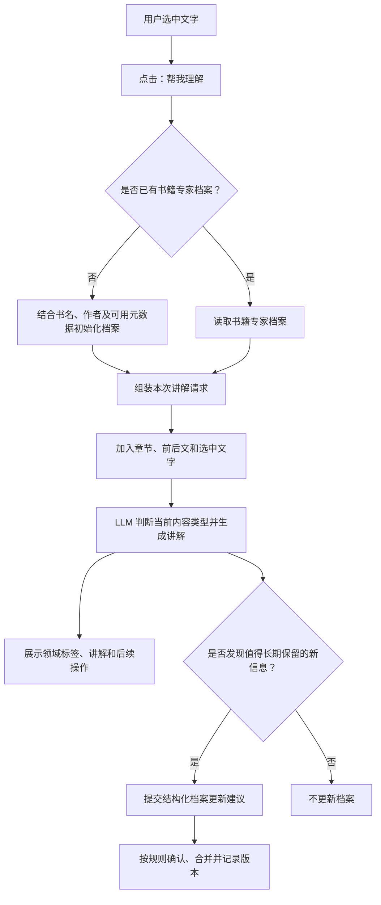

# Readest「帮我理解」PRD

## 1. 文档信息

- 功能：帮我理解 / Expert Explanation
- 状态：方案草案
- 适用端：Readest Web、Desktop、iOS、Android
- 相关模块：阅读器选区菜单、AI 服务、书籍元数据、持久化存储

## 2. 产品概述

用户阅读时选中难以理解的内容，可在“翻译”旁点击 **帮我理解**。

AI 结合书名、作者、章节、选中文字及其前后文，判断内容所属的知识领域与内容类型，并采用该领域最合适的教学方式进行讲解。

产品承诺：

> 不只是改写或翻译原文，而是用适合这本书和当前内容的方式把它讲清楚。

## 3. 用户问题

阅读专业书籍时，用户可能理解字面意思，却不了解概念、论证、公式、背景或隐含含义。通用的“AI 解释”缺少整本书的领域视角，多次讲解也容易出现角色、术语和深度不一致。

用户需要：

- 在阅读现场直接获得讲解，不离开当前内容
- 讲解能够理解书籍与章节语境
- 不同类型内容采用不同教学方法
- 同一本书的专家视角和术语保持一致
- 可以通过后续操作获得例子、背景或更深入的解释

## 4. 目标与非目标

### 4.1 目标

1. 在选区菜单中提供低打扰的“帮我理解”入口。
2. 根据书籍信息建立可持续更新的书籍专家档案。
3. 根据当前内容类型选择合适的讲解方式。
4. 保持同一本书内领域视角、教学原则和术语的一致性。
5. 通过稳定 Prompt 前缀提高 LLM Prompt Cache 的复用率。
6. 在信息不足或存在多种解释时明确表达不确定性。

### 4.2 非目标

首版不包含：

- 判断用户具体“卡在哪里”
- 专家市场或大量预设专家供用户选择
- 根据单次选区永久改变整本书的主要领域
- 自动构建整本书知识图谱
- 用专家身份代替医疗、法律、投资等专业建议

## 5. 核心体验

### 5.1 入口

用户选中文字后，选区菜单显示：

```text
翻译 ｜ 帮我理解
```

点击“帮我理解”后打开讲解面板。面板顶部显示轻量标签，例如：

```text
宏观经济学 · 概念讲解
```

正文直接进入讲解，不使用“作为一名拥有多年经验的专家”等角色扮演开场。

### 5.2 讲解方式

AI 先识别内容类型，再使用相应教学方法：

| 内容类型 | 讲解重点 |
| --- | --- |
| 概念 | 定义、直觉、例子、适用边界 |
| 论证 | 前提、推理过程、结论、成立条件 |
| 公式 | 符号含义、关系、必要推导、简单算例 |
| 代码 | 目的、执行过程、关键语句、输入输出 |
| 历史事件 | 背景、过程、影响 |
| 文学内容 | 上下文、语气、表达手法、可能含义 |
| 哲学观点 | 核心概念、论证、争议与反例 |

讲解完成后，根据当前内容动态提供最多三个后续操作，例如：

- 举个例子
- 讲得更深入
- 补充背景
- 逐句解释
- 解释公式
- 这个观点有什么争议？

## 6. 运行流程



首次使用时，书籍档案初始化与当前讲解应尽量在一次 LLM 请求中完成，避免两次串行请求带来的延迟。也可在书籍导入后由后台提前初始化。

## 7. 书籍专家档案

书籍专家档案是持久化产品数据，不是临时缓存。它描述“这本书是什么，以及应该怎样讲解”，可以被纠正、补充、版本化和复用。

建议结构：

```json
{
  "schemaVersion": 1,
  "revision": 3,
  "bookId": "book-123",
  "classification": {
    "primaryDomain": "理论物理学",
    "relatedDomains": ["宇宙学", "天文学"],
    "confidence": 0.94
  },
  "expert": {
    "role": "擅长面向普通读者讲解的理论物理学教师",
    "teachingPrinciples": [
      "优先建立物理直觉",
      "必要时使用类比并说明类比边界"
    ],
    "domainRules": [
      "区分实验事实、主流理论与推测"
    ]
  },
  "bookKnowledge": {
    "themes": ["宇宙起源", "时间与空间"],
    "terminology": {
      "event horizon": "事件视界"
    }
  },
  "provenance": {
    "initializedFrom": ["title", "author", "metadata"],
    "updatedAt": "2026-07-22T10:00:00Z"
  }
}
```

### 7.1 更新原则

- 一次特殊选区只能影响本次讲解，不能直接改变整本书的主要领域。
- 新发现先作为候选信息；有重复证据或高置信度时再写入长期档案。
- 新增相关领域比覆盖主要领域更容易。
- 用户手动纠正的优先级高于模型推断。
- 每次持久化更新增加 `revision`，保留来源与更新时间。
- 模型只返回结构化更新建议，不自由改写整个档案。
- 书籍核心档案低频更新；章节特有信息不应污染书籍级核心信息。

书籍档案与用户偏好必须分开：书籍档案描述内容领域，用户档案描述讲解深度、语言和表达偏好。

## 8. Prompt 设计与缓存

最终 Prompt 由程序确定性组装，不让模型每次重新生成角色模板：

```text
1. 全局固定讲解规则
2. 书籍核心专家档案
3. 书籍增量知识
4. 当前章节背景
5. 选区前后文
6. 当前选中文字
7. 固定输出结构
```

稳定内容放在前面、动态内容放在后面，以适配常见的 LLM 前缀缓存机制：

```text
全局固定前缀
└── 书籍固定前缀
    └── 章节固定前缀
        └── 当前选区
```

实现要求：

- 字段顺序、换行和序列化方式保持稳定。
- 稳定前缀中不加入时间、请求 ID 等动态信息。
- 书籍核心档案不因每次讲解而更新。
- 档案增长后，只选择与当前章节相关的增量知识发送给模型。
- 记录模型、Prompt 版本和档案版本，便于失效与迁移。

除供应商的 Prompt Cache 外，可以按 `bookId + profileRevision + chapterId + selectionHash + promptVersion + model` 建立应用级结果缓存，用于直接复用完全相同的讲解。

## 9. LLM 输出契约

```json
{
  "domain": "经济学",
  "subdomain": "宏观经济学",
  "contentType": "概念与因果论证",
  "label": "宏观经济学 · 概念讲解",
  "explanation": "...",
  "followUps": [
    "举一个现实中的例子",
    "展开解释因果关系",
    "这个观点有什么局限？"
  ],
  "profileUpdate": null
}
```

讲解必须满足：

- 不只翻译或改写原文。
- 不展示模型的领域判断过程。
- 使用用户当前界面语言。
- 准确、循序渐进、通俗但不过度简化。
- 文学和哲学内容不把一种解释描述为唯一答案。
- 医疗、法律、投资等内容明确为知识讲解，不构成专业建议。
- 上下文不足时说明不确定性，不虚构背景。

## 10. 异常与边界情况

- 只有书名：允许初始化低置信度档案，后续用章节内容纠偏。
- 同名书：优先结合作者、语言、ISBN 和元数据识别。
- 跨领域书籍：保留一个主要领域和多个相关领域，当前选区可临时切换视角。
- 选区过短：结合前后文解释；仍有歧义时列出可能含义。
- 缺少上下文：仍可讲解选区，但提示解释范围有限。
- AI 服务不可用：保留选区并提供重试，不生成伪结果。

## 11. 首版范围

首版包含：

1. “翻译”旁新增“帮我理解”。
2. 获取书名、作者、章节、选区和有限前后文。
3. 初始化并持久化书籍专家档案。
4. 根据领域与内容类型生成讲解。
5. 展示领域标签、讲解正文和动态后续操作。
6. 支持结构化档案更新建议与版本记录。
7. 使用稳定 Prompt 前缀，为 Prompt Cache 提供命中条件。

首版暂不实现复杂知识图谱、用户能力推断和专家选择市场。

## 12. 验收标准

- 用户可以从阅读选区菜单进入“帮我理解”。
- 请求至少包含书名、选中文字；可用时包含作者、章节和前后文。
- 同一本书首次使用后存在可持久化、可版本化的专家档案。
- 后续请求复用该档案，且不会因单次特殊选区覆盖主要领域。
- 概念、论证、公式、代码、历史和文学内容采用不同的讲解策略。
- 输出包含领域标签、讲解正文及不超过三个相关后续操作。
- 最终 Prompt 的稳定内容位于动态选区之前，且使用确定性序列化。
- 档案更新包含来源、置信度或证据，并增加版本号。
- 信息不足或存在多种合理解释时，结果明确表达不确定性。

