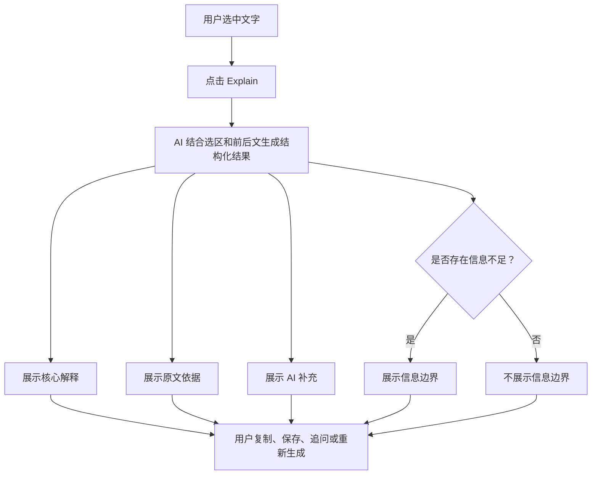

# Readest Explain 来源透明度 MVP PRD

## 1. 文档信息

- 功能：Explain 来源透明度
- 状态：方案草案
- 适用端：Readest Web、Desktop、iOS、Android
- 相关模块：阅读器选区菜单、Notebook Assistant、Explain 结果弹窗、Notebook 卡片

## 2. 背景

Readest 的 Explain 功能允许用户选中文字后，结合书籍、章节及前后文获得 AI 讲解。当前结果会展示领域标签、讲解正文和后续操作，但用户无法明确区分：

- 哪些内容直接来自选中文字
- 哪些内容需要结合前后文理解
- 哪些内容是 AI 为帮助理解而补充的例子、类比或背景
- 哪些判断因上下文不足而存在不确定性

这会降低用户对讲解结果的信任，尤其是在专业书籍、论文、历史、哲学、医疗、法律和金融等内容中。

本次改动以较小的实现成本，为 Explain 增加基础来源透明度，不建设完整的逐句引用或证据追踪系统。

## 3. 产品目标

用户阅读 Explain 结果时，能够快速回答：

1. AI 对原文的核心解释是什么？
2. 这份解释主要依据了哪些原文？
3. 哪些内容是 AI 为了帮助理解而补充的？
4. 当前解释是否存在明确的信息边界？

产品应让用户理解信息来源，同时保持 Explain 弹窗简洁、低打扰。

## 4. 非目标

本次 MVP 不包含：

- 为解释中的每一句话绑定证据
- 为前后文生成精确 CFI
- 点击引用跳转到原文
- 章节级或整本书级检索
- 自动计算可信度分数
- 对模型引用执行严格的字符串匹配校验
- 建设独立的证据侧边栏
- 修改 NotebookCard 的持久化数据结构

上述能力可在验证 MVP 价值后逐步建设。

## 5. 核心体验

### 5.1 用户流程



### 5.2 结果结构

Explain 结果最多包含四个区块：

#### 核心解释

必须展示。直接回答选中文字的含义，避免只做翻译或改写。

#### 原文依据

可选展示。列出最多两条来自选中文字或前后文的短引用，并标注来源：

- 选中文字
- 前后文

#### AI 补充

可选展示。用于承载模型为了帮助理解而提供的例子、类比、背景知识或推导。

该区块必须与原文依据明确区分，避免用户误认为补充内容来自书中。

#### 信息边界

可选展示。当上下文不足、术语存在歧义或存在多种合理解释时，说明当前无法确定的内容及原因。

信息充分时不展示该区块。

### 5.3 展示示例

```text
宏观经济学 · 概念讲解

核心解释
物价上涨意味着相同金额能够购买的商品减少。

原文依据
“通货膨胀会降低货币的实际购买力”
选中文字

AI 补充
例如原来 100 元可以买 10 件商品，涨价后可能只能买 8 件。

信息边界
当前内容没有说明通货膨胀产生的具体原因。
```

## 6. 交互与视觉要求

### 6.1 默认展示

- 核心解释始终展开。
- 原文依据、AI 补充和信息边界仅在有内容时展示。
- 每个区块使用轻量标题区分。
- 不使用“可信度百分比”。
- 不使用大面积警告色。
- 信息边界可使用轻量提示图标或弱强调色。

### 6.2 原文依据

- 每条引用最多 300 个字符。
- 最多展示两条引用。
- 引用正文使用引号或引用样式。
- 引用下方显示“选中文字”或“前后文”。
- MVP 不支持点击跳转。

### 6.3 AI 补充

- 只展示帮助理解所需的例子、类比、背景或推导。
- 不应重复核心解释。
- 不应伪装成书中原文。

### 6.4 信息边界

- 只在确实存在信息不足或合理歧义时出现。
- 应说明缺少什么信息，而不只写“可能不准确”。
- 不应对每次讲解都展示通用免责说明。

### 6.5 现有操作

以下操作保持不变：

- 复制
- 保存到 Notebook
- 后续追问
- 重新生成
- 重建书籍领域档案

## 7. 数据结构

### 7.1 Explain 结果

```ts
export interface ExplanationEvidence {
  quote: string;
  source: 'selection' | 'context';
}

export interface ExpertExplanationResult {
  domain: string;
  subdomain: string;
  contentType: string;
  label: string;
  explanation: string;
  evidence: ExplanationEvidence[];
  supplemental?: string;
  uncertainty?: string;
  followUps: ExplanationFollowUp[];
  expertProfile?: BookExpertProfile;
}
```

### 7.2 字段说明

| 字段 | 必填 | 说明 |
| --- | --- | --- |
| `explanation` | 是 | 核心解释 |
| `evidence` | 是 | 原文引用数组，无引用时为空数组 |
| `evidence.quote` | 是 | 从选区或前后文逐字摘取的短引用 |
| `evidence.source` | 是 | `selection` 或 `context` |
| `supplemental` | 否 | AI 补充的例子、类比、背景或推导 |
| `uncertainty` | 否 | 当前信息边界及其原因 |

## 8. 模型输出契约

模型应返回一个有效 JSON 对象：

```json
{
  "domain": "经济学",
  "subdomain": "宏观经济学",
  "contentType": "概念",
  "label": "宏观经济学 · 概念讲解",
  "explanation": "物价上涨意味着相同金额能够购买的商品减少。",
  "evidence": [
    {
      "quote": "通货膨胀会降低货币的实际购买力",
      "source": "selection"
    }
  ],
  "supplemental": "例如原来 100 元可以买 10 件商品，涨价后可能只能买 8 件。",
  "uncertainty": "当前内容没有说明通货膨胀产生的具体原因。",
  "followUps": [
    {
      "id": "example",
      "label": "再举一个例子"
    }
  ]
}
```

### 8.1 Prompt 规则

- `explanation` 必须解释原文，不得只做翻译或改写。
- `evidence.quote` 必须逐字来自选中文字或提供的前后文。
- `evidence.source` 必须是 `selection` 或 `context`。
- `evidence` 最多包含两条。
- AI 自己生成的例子、类比和背景不得放入 `evidence`。
- AI 补充内容统一放入 `supplemental`。
- 信息充分时省略 `uncertainty` 或返回空值。
- 信息不足时，`uncertainty` 必须说明缺少什么信息。
- 文学、哲学等存在多种合理解释的内容，不得把一种解释表述为唯一结论。
- 医疗、法律和金融内容继续遵循现有教育性解释规则。

## 9. 解析与兼容

### 9.1 容错规则

- `evidence` 缺失时转换为空数组。
- 非数组 `evidence` 转换为空数组。
- 缺少 `quote` 的引用项丢弃。
- `source` 不是 `selection` 或 `context` 的引用项丢弃。
- 空白 `supplemental` 和 `uncertainty` 转换为 `undefined`。
- 每条引用截断至 300 个字符。
- 最多保留两条有效引用。

### 9.2 旧格式兼容

若模型或自定义兼容接口只返回原有字段：

```json
{
  "explanation": "..."
}
```

应用仍应正常展示核心解释，不显示其他三个可选区块。

新增字段解析失败不得导致整个 Explain 请求失败。

## 10. 后续追问

MVP 延续现有追问行为：

- 初次讲解使用结构化区块展示。
- 后续追问结果追加到当前解释下方。
- 后续追问暂不要求返回独立证据区块。
- 追问结果仍可复制和保存。

本次不重构 Explain 为完整消息线程。

## 11. 保存到 Notebook

MVP 不修改 NotebookCard 数据结构。

保存时将结构化结果序列化为普通文本：

```text
领域标签

核心解释
...

原文依据
- “……”（选中文字）

AI 补充
...

信息边界
...
```

不存在的区块不写入保存内容。

保存后的卡片继续保留现有选区 CFI、模型、Provider 和 Token 估算信息。

## 12. 异常与边界情况

### 12.1 没有有效引用

只展示核心解释。不得使用空的“原文依据”区块占位。

### 12.2 选区过短

模型可以结合前后文解释。仍存在歧义时必须返回信息边界。

### 12.3 选区过长

延续现有 Token 估算、费用提醒和每日限额行为。

### 12.4 模型未遵循输出结构

若仍能解析到 `explanation`，展示核心解释；否则沿用现有无效响应错误。

### 12.5 自定义模型能力不足

不得因为缺少新增字段而阻止用户使用 Explain。

## 13. 埋点建议

在不记录原文内容的前提下，可记录：

- Explain 成功结果中是否包含 evidence
- 是否包含 supplemental
- 是否包含 uncertainty
- 用户是否点击保存到 Notebook
- 用户是否继续追问
- 用户是否重新生成

MVP 不新增强制埋点；若现有使用统计能够扩展，可作为后续评估依据。

## 14. 验收标准

- 用户能够区分核心解释、原文依据和 AI 补充。
- 信息不足时能够看到具体的信息边界。
- 信息充分时不会出现多余的警告。
- 原文依据最多两条，并标注来自选区或前后文。
- 新增区块不会显著增加弹窗默认长度。
- 老格式响应仍可正常展示。
- 翻译功能不受影响。
- 复制、追问、重新生成和保存到 Notebook 保持可用。
- Notebook 保存结果包含当前可见的结构化内容。
- 不修改上下文提取、同步格式、CFI 系统和 NotebookCard 数据结构。

## 15. 测试范围

### 15.1 服务层

- 完整结构能够正确解析。
- 缺少新增字段时能够兼容。
- 无效 evidence source 被丢弃。
- 空引用被丢弃。
- evidence 最多保留两条。
- 单条引用长度受到限制。
- 空 supplemental 和 uncertainty 不进入结果。

### 15.2 UI

- 核心解释始终展示。
- 空 evidence 不显示原文依据。
- supplemental 存在时显示 AI 补充。
- uncertainty 存在时显示信息边界。
- loading、error 和未配置状态保持正常。
- 追问结果仍能追加。

### 15.3 Notebook

- 保存结果包含领域标签和核心解释。
- 可选区块按实际内容保存。
- 重复点击保存仍受到现有保护。
- 原有 Notebook 卡片展示不受影响。

### 15.4 回归

- AI Translate 不受影响。
- Explain Token 估算和每日限额不受影响。
- Expert Profile 初始化与重建不受影响。
- 不同 Provider 和自定义兼容接口仍可使用。

## 16. 实施范围

主要修改：

- `src/services/notebook-assistant/types.ts`
- `src/services/notebook-assistant/client.ts`
- `src/app/reader/components/annotator/SelectedTextAssistantPopup.tsx`
- Notebook Assistant 相关单元测试

预计不修改：

- `src/services/notebook-assistant/context.ts`
- NotebookCard 数据模型
- 同步和数据库迁移
- CFI 生成与跳转逻辑

## 17. 后续演进

MVP 验证有效后，可按以下顺序演进：

1. 程序校验引用是否真实存在于选区或前后文。
2. 为上下文 block 增加稳定 ID。
3. 为引用保存 CFI。
4. 支持点击引用跳回原文。
5. 为解释中的具体观点绑定来源。
6. 扩展到当前页、当前章节等上下文范围。
